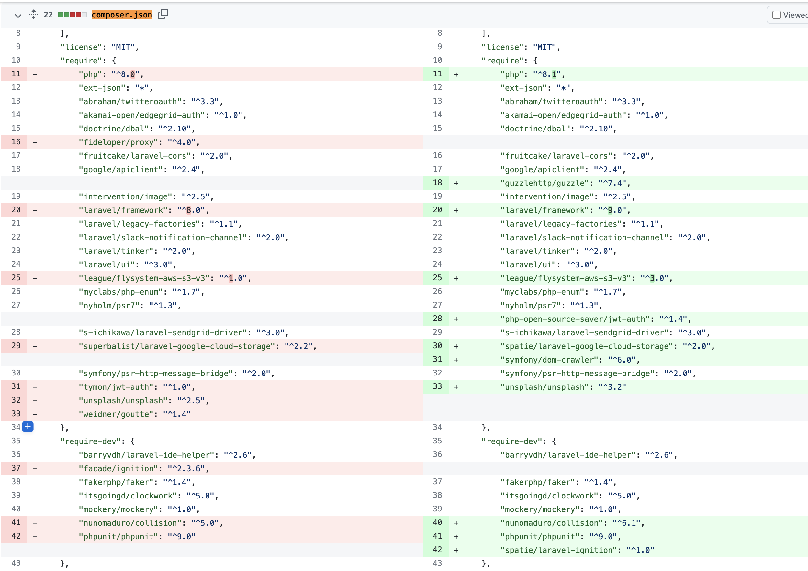

## Laravel8→9アップデートTips

---

とりあえずこれをやります

### Migrating from PHP 8.0.x to PHP 8.1.x
https://www.php.net/manual/en/migration81.php


### Laravel 9.x アップグレードガイド
https://readouble.com/laravel/9.x/ja/upgrade.html


---

# 問題はここからでした

---


## 使っているライブラリがLaravel9に対応していない

---




---

### 主にここら辺

- tymon/jwt-auth
    - 最近見たら2022-04-12にLaravel9に対応してた笑
- superbalist/laravel-google-cloud-storage
    - 最後のコミットが2020年9月
- weidner/goutte
    - 最後のコミットが2021年2月

---


## tymon/jwt-auth
laravelでいい感じにjwtを使えるライブラリです。

<br>

鈴木さんがいい感じのを見つけてきました
https://github.com/php-open-source-saver/jwt-auth

tymon/jwt-authをフォークして作られたようです

移行手順は超簡単
- ① `composer remove tymon/jwt-auth`を実行
- ② ネームスペースを`Tymon\JWTAuth`→`PHPOpenSourceSaver\JWTAuth`
- ③ `composer require php-open-source-saver/jwt-auth`を実行

---

<div style="text-align: center;font-size: 42px;">
    <h2>やったね！</h2>
</div>


---

## superbalist/laravel-google-cloud-storage
LaravelでGCPを使うためのライブラリです。

<br>

鈴木さんがまたしてもいい感じのを見つけてきました。ベルギーの会社がメンテしてるらしい
https://github.com/spatie/laravel-google-cloud-storage


移行手順は

一部`config/filesystems.php`を修正するくらいでそのまま使えました！

---

<div style="text-align: center;font-size: 42px;">
    <h2>わーい！</h2>
</div>

---

ちなみに`spatie/laravel-google-cloud-storage`の中身を調べてみると

<br>

↓のラッパー。これは各ベンダー（S3、Azure等）のファイルストレージのインターフェースを共通化するPHPライブラリです。
https://github.com/thephpleague/flysystem-google-cloud-storage

↓のラッパー。これはgoogle公式のPHP向けライブラリです
https://github.com/googleapis/google-cloud-php-storage

---


## weidner/goutte
Laravelでスクレイピングをするためのライブラリです

<br>

移行手順は・・

**そもそもライブラリ使うのやめました！**

LaravelのHttpクライアント＋symfonyのdom-crawlerを使うことで解決

```php
$response = Http::withHeaders(self::DEFAULT_HEADERS)->get($url);
$this->crawler = new Crawler(node: $response->body(), baseHref: $this->baseUrl);
$this->crawler->filter('title')->text();
```

---

これに至った経緯なんですが

`weidner/goutte`をよく調べてみると

<br>

↓のラッパー。これはPHPのスクレイピング用ライブラリ。
https://github.com/FriendsOfPHP/Goutte

↓のラッパー。これはsymfonyのHttpクライアントやdom解析が入ったライブラリです。
https://github.com/symfony/browser-kit

---

## 無事ライブラリのアプデ完了！

---


------


ちなみになんですが、laravel本体のソースも見てみたら
symfonyのラッパーみたいな感じで面白かったです。
https://github.com/laravel/framework

---

## おまけ PHP8.1＆Laravel9で気になる機能

---

## PHP8.1

- enum（割愛）
- str_contains関数（ようやくstr_posのあれを書かなくて済む？）
- 文字列をキーに持つ配列のアンパック（jsのスプレッド構文みたいなやつ）

```php
$arr1 = [1, 'a' => 'b'];
$arr2 = [...$arr1, 'c' => 'd']; //[1, 'a' => 'b', 'c' => 'd']
```

---

## Laravel9 

- ルートバインティングでenumが使えるように

```php
enum Category: string
{
    case Fruits = 'fruits';
    case People = 'people';
}
```

```php
Route::get('/categories/{category}', function (Category $category) {
    return $category->value;
});
```

---

- Eloquentのcastsにenumが使えるように

```php
use App\Enums\ServerStatus;
 
 ...
 
/**
 * The attributes that should be cast.
 *
 * @var array
 */
protected $casts = [
    'status' => ServerStatus::class,
];
```

---

おしまい
